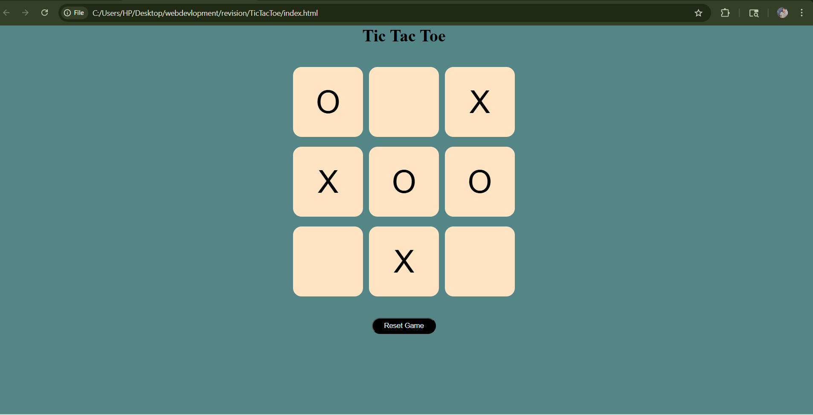

# ❌⭕ Tic Tac Toe Game


---

## 🎮 Description

A simple and interactive **Tic Tac Toe game** built using **HTML, CSS, and JavaScript**.
Play against another player and enjoy real-time game logic with instant win/draw detection.

---

## 🚀 Features

* 👥 Two-player gameplay
* 🎯 Win and draw detection
* 🔄 Game reset functionality
* ⚡ Fast and responsive UI
* 🎨 Clean and user-friendly design

---

## 🛠️ Technologies Used

* HTML5
* CSS3
* JavaScript (Vanilla JS)

---

## 📂 Project Structure

```
tic-tac-toe/
│── index.html
│── style.css
│── script.js
```

---

## 🎮 How to Play

1. Player 1 starts with ❌
2. Player 2 plays with ⭕
3. Take turns selecting empty cells
4. First to get 3 in a row wins
5. If all cells are filled → Draw

---

## 📸 Screenshots



---

## 🔗 Live Demo

(Add your live link after deployment)

Example:

```
https://jitendradangi.github.io/tic-tac-toe/
```

---

## 📌 Future Improvements

* Add AI (Play vs Computer 🤖)
* Add sound effects 🔊
* Add animations 🎨
* Improve mobile responsiveness 📱

---

## 🙌 Author

* **Jitendra Dangi**

---

⭐ If you like this project, don’t forget to star the repository!
